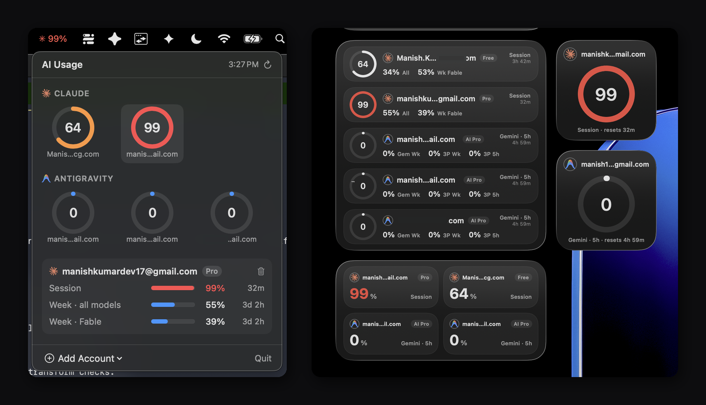

# AI Usage

A macOS menu bar app + desktop widget that tracks your usage limits across AI coding tools — every account in one place.



## What it shows

- **Menu bar**: your most-used limit as a live percentage (color-coded as you approach the cap).
- **Panel** (click the menu bar item): usage rings for every account — session and weekly limits, with reset times.
- **Desktop widget** (small / medium / large): the same rings on your desktop, per account or all accounts.

Usage refreshes every 5 minutes, straight from the providers' own usage APIs.

## Supported providers

| Provider | Accounts | How it connects |
|---|---|---|
| **Claude** (Pro / Max / Team) | multiple | Reads the OAuth token of your local [Claude Code](https://claude.com/claude-code) login — no separate sign-in |
| **Antigravity** (Gemini) | multiple | One-time Google sign-in in your browser |

### Claude: multiple accounts

The app discovers **every** Claude Code login on your Mac:

- **One `~/.claude`, several accounts**: log into an account in Claude Code, click *Add Account → Claude*, switch accounts (`/login`), add again. Both stay tracked.
- **Several config dirs** (`CLAUDE_CONFIG_DIR`): dirs like `~/.claude`, `~/.claude-work`, `~/.claude-personal` are found automatically — one click imports all of their logged-in accounts at once. (Custom dirs are discovered when they live in your home folder and are named `.claude*`.)

## Install

1. Download the latest `AI Usage.app` from [Releases](../../releases).
2. Move it to `/Applications` and launch it.
3. macOS will warn that the app is from an unidentified developer (it isn't notarized). Right-click the app → **Open** → **Open**, or run:
   ```bash
   xattr -dr com.apple.quarantine "/Applications/AI Usage.app"
   ```
4. Click the `✳` item in the menu bar → **Add Account**.

> **Keychain note:** to import a Claude account the app reads Claude Code's credential from your login keychain using the system `security` tool. macOS may ask for permission the first time — if an import comes up empty, approve the keychain prompt (or just click *Add Account* again).

## Privacy

Everything stays on your Mac. The app:

- reads credentials from your local keychain / config files, and stores the accounts it tracks in your keychain;
- talks only to the providers' official endpoints (`api.anthropic.com`, `console.anthropic.com`, `oauth2.googleapis.com`, `cloudcode-pa.googleapis.com`) to fetch usage;
- has no analytics, no telemetry, no server of its own.

## Build from source

Requirements: macOS 14+, Xcode 15+, [xcodegen](https://github.com/yonaskolb/XcodeGen) (`brew install xcodegen`).

```bash
cd ClaudeUsageApp

# Use your own Apple development team + bundle id prefix
#   project.yml → DEVELOPMENT_TEAM, bundleIdPrefix

xcodegen generate
xcodebuild -project ClaudeUsage.xcodeproj -scheme ClaudeUsage \
  -configuration Release -derivedDataPath build build

cp -R "build/Build/Products/Release/AI Usage.app" /Applications/
```

See [ClaudeUsageApp/DEVELOPMENT.md](ClaudeUsageApp/DEVELOPMENT.md) for the full development guide — including the widget-caching ritual you need on every install.

## License

[MIT](LICENSE)
